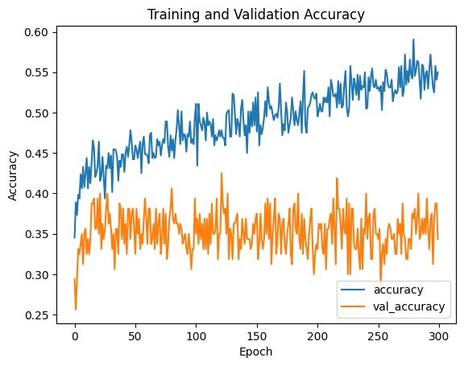

# Capstone Project: Retail Sales
# Data Science Institute - Cohort 5 - Team 11 Project

# Project Overview:

As part of the Data Science Certificate program at the University of Toronto our machine learning capstone project involved applying our theoretical and technical skillset to a real world scenario. The dataset we chose was a Retail Sales dataset that can be used to predict the product category a customer is likely to purchase based on factors such as their age, gender/sex, and previous purchase history. This project aims to apply exploratory data analysis, advanced analytics, and machine learning techniques to gain actionable insights that can help businesses optimize product inventory, and enhance customer engagement. 

# Requirements
This project uses the following Python libraries and tools.

* numpy : For faster numerical operations.
* pandas : For analysing and getting insights from datasets.
* matplotlib : For creating graphs and plots.
* seaborn : For enhancing the style of matplotlib plots.
* sklearn : For machine learning.
* xgboost : For gradient boosting algorithm.
* tensorflow :For deep learning model.
* shap : For interpreting and explaining output of xgboost model.

* SQLite and sql : For data processing.

# Dataset:

Our retail sales dataset from Kaggle ([Retail Sales Dataset](https://www.kaggle.com/datasets/mohammadtalib786/retail-sales-dataset)) consists of attributes that drive retail operations and customer interactions that can be oberved in the real world. The dataset consists of essential attributes such as Transaction ID, Date, Customer ID, Gender, Age, Product Category, Quantity, Price per Unit, and Total Amount. These attributes allow for an in-depth exploration of sales trends, product preferences, and puchasing behaviour. The analysis and insights gained from this project can be used to personalize products to each customer in the future. Based on our insights, this project demonstrates our team work and potential to contribute to the data science or machine learning field.

# Members

| Name                     | LinkedIn Profile | GitHub Profile |
|--------------------------|-----------------|---------------|
| Abrahim Senra Abrahao   | [LinkedIn](https://www.linkedin.com/in/abrahimsa) | [GitHub](https://github.com/AbrahimSA) |
| Amit Kumar Sindhwani    | [LinkedIn](https://www.linkedin.com/in/amit-sindhwani/) | [GitHub](https://github.com/amitsindhwani) |
| Hamid Moaf             | [LinkedIn](#) | [GitHub](https://github.com/hamimoaf) |
| Lisa Thurairasu        | [LinkedIn](https://www.linkedin.com/in/lisathurairasu/) | [GitHub](https://github.com/lthurair) |
| Nipun Puri            | [LinkedIn](https://www.linkedin.com/in/nipunpuri/) | [GitHub](https://github.com/nipunpuri) |
| Sreesha Pannikode Puthanveedu | [LinkedIn](https://www.linkedin.com/in/sreesha-pannikode-puthanveedu-22216498) | [GitHub](https://github.com/Sreeshap01) |

# Business Case:

Retail businesses often struggle to identify which products are most likely to be purchased by specific customer segments. This results in:

- **Inefficient marketing strategies** Generic promotions instead of personalized recommendations.
- **Suboptimal inventory management** Stocking products without understanding demand from different customer groups.
- **Missed revenue opportunities** Lack of tailored cross-sell and up-sell strategies.

This project focuses on the following objectives:
- Predict the likelihood of a customer purchasing specific product categories based on their age, gender/sex, previous purchase history
- Enable personalized recommendation of the next product category

# Project Plan:

To explore the retail sales dataset, we will focus on the following objectives:
1. **Data Preparation:** 
    - Data cleaning, determining outliers and missing values, transforming variables
2. **Exploratory Data Analysis (EDA):**
    - Understand sales trends, customer purchasing behaviour, product preferences, and influential factors
3. **Feature Engineering:** 
    - Create and derive new features, perform one-hot encoding or create dummy variables
4. **Customer Segmentation:** 
    - Apply clustering algorithms (i.e., K-Means or KNN) to identify customer groups based on purchasing behaviour
5. **Model development and Evaluation:** 
    - Build several models to predict what product category a customer will purchase and determine the best-fitting model based on evaluation metrics.
    
        Models include:
        - **XGBoost Model:** a decision tree classifier
        - **Feed Forward Neural Network:** deep learning model
        - **Recommendation System:** another deep learning model
6. **Business Insights:** 
    - Summary findings of the data analysis, models, and results will help the retail store owner manage product inventory by knowing what products customers are buying and thus, will help increase customer satisfaction.

# Exploratory Data Analysis:
Our retail sales dataset consists of following attributes: 

1. **Transaction ID:** Each transaction in the dataset is represented by a unique identifier that allows tracking and reference.

2. **Date:** Ths attribute represents the date when the transaction occurred, it helps in understanding sales in specific month or periods.

3. **Customer ID:** This is a unique identifier that represents the customer who made that transaction. This attributes enabling customer-centric analysis.

4. **Gender:** This attribute represents the gender of the customer - Male or Female. This helps in gaining insights into gender-based purchasing patterns.

5. **Age:** This attribure represents the age of the customer. The age allows to understand age related purchasing behaviours and segmentation. 

6. **Product Category:** This attribute Specifies the type of product purchased, such as Electronics, Clothing, or Beauty. This helps in identifying sales trends, customer preferences, and category-wise revenue distribution.

7. **Quantity:** Represents the number of units of a product bought in a transaction. Analyzing quantity data helps in demand forecasting, inventory management, and identifying high-volume products.

8. **Price per Unit:** This attribute indicates the cost of a single unit of the product. This is essential for calculating revenue, and analyzing price sensitivity among customers.

9. **Total Amount:** The overall transaction value derived from multiplying quantity by price per unit. This metric is crucial for revenue analysis, customer spending patterns, and profitability assessments.

## Findings on the Retail Dataset

- The dataset contains no missing values.
- There are no duplicate rows in the data.

### Some findings on the columns 
- Gender:
    - There are two unique values:
        - Female
        - Male
    - 51% of purchases were made by female customers, and 49% by male customers.

- Age
    - Customer ages range from 18 to 64 years old.
    - The mean age of customers is approximately 41 years.
    - The age range for Female customers is between 18 and 64 years.
    - Similarly, the age range for Male customers is between 18 and 64 years.

- Quantity
    - The minimum quantity purchased per transaction is 1, and the maximum is 4.
    - The average quantity purchased per transaction is 2.5 (approximately 3).

- Product Category
    - There are three unique product categories in the data:
        - Beauty
        - Clothing
        - Electronics 

    - The distribution of transactions in each of these categories is as follows
        - Clothing       35.1%
        - Electronics    34.2%
        - Beauty         30.7%

- Price per Unit
    - The minimum price per unit is $25, and the maximum price is $500.
    - The average price per unit is $180.
    - The price range for the Beauty category is between $25 and $500.
    - The price range for the Clothing category is between $25 and $500.
    - The price range for the Electronics category is between $25 and $500.

## Plotted the monthly max and min sales and the top performing product category
- The plot reveals that the Electronics product category recorded the highest sales in February, May, June, August, October, and December of 2023
- Meanwhile, the Clothing category led in sales during January, March, April, September, and November of the same year.

**This insight suggests that businesses should prioritize**
- stocking popular products in the high-performing Electronics category, followed by Clothing, to maximize sales opportunities.

## Plotted the total sales based on Age groups
- The plot indicates that the majority of customers fall within the 36-65 age range.
- The 56-65 age group has the highest number of purchases, followed closely by the 36-45 and 46-55 age groups, with only a slight variation in sales among them.

**This insight suggests that businesses should prioritize**
- Tailoring marketing strategies and product offerings to appeal to customers aged 36-65.
- Creating loyalty programs or personalized promotions for the 56-65 demographic, as they are the most active buyers.
- Ensuring a seamless shopping experience to cater to this age group’s preferences

# Identified Risks in the Dataset

**1. Limited Data Volume (High Risk)**
The dataset has only 1,000 rows, which may lead to low model accuracy and an inability to generalize insights for large-scale retail scenarios.

**2. Lack of Customer Purchase History (High Risk)**
Each customer has only one transaction, making it impossible to track customer loyalty or segment based on repeat purchases. This limits the ability to build customer retention strategies.

**3. No Purchase Frequency Insights (High Risk)**
Without timestamped transaction data, it is impossible to determine monthly/quarterly purchase trends, affecting demand forecasting and inventory planning.

**4. Missing Transaction Channel (Medium Risk)**
The dataset does not differentiate between in-store and online purchases, reducing the ability to perform channel-specific analysis and optimize marketing efforts.

**5.Lack of Granular Product Details (Medium Risk)**
Product categories are too broad (e.g., "Electronics"), preventing a detailed analysis of popular products, brands, or price preferences, limiting precise recommendations.

# Feature engineering
- We begin with a transaction dataset where each record represents a customer's transaction. Customer-level features are engineered for model training, as defined in feature_eng.sql

### Customer-Level Features

- **Customer_ID:** Unique customer identifier.
- **age_range:** Age binned into groups (<20, 20–29, 30–39, 40–49, 50–59, ≥60) and dummy-coded.
- **HolidayName:** Last holiday shopped, encoded as an indicator.
- **Month_name:** Transaction month to capture seasonality.
- **spend_3m:** Total spend in the last 3 months.
- **QTY_3m:** Total units purchased in the last 3 months.
- **spend_12m:** Total spend in the last 12 months.
- **QTY_12m:** Total units purchased in the last 12 months.
- **gender_dummy:** Gender encoded as a dummy variable.

### External Data (Toronto)

- **Max_Temp:** Daily maximum temperature.
- **Min_Temp:** Daily minimum temperature.
- **Mean_Temp:** Daily average temperature.
- **Total_Precip_mm:** Daily precipitation (mm).

### Target Variable

- **Product_Category**

# Segmentation
- **K-means** clustering was used to find out whether we can group customers based on their spending behaviour as influenced by age and group.

### Total Amount vs Age

Age and Total Amount were selected as the features. They were standardized using StandardScaler function, and the data was visualized.

K-Means clustering was performed by using and **n_clusters** was set to 3 randomly.Visualization on the clustered data revealed three distinct clusters:

1. A younger group with relatively lower spending.
2. An  older group with relatively lower spending.
3. A diverse group across all age ranges with higher spending.

The number of customers in the high-spending group is smaller compared to the low-spending groups.

Then **Elbow method** was used to find the optimal number of clusters. The Elbow plot between **WSSD** and **k**confirmed that the inital random selection of n as 3 was the correct choice.

### Total Amount vs Gender

A similar approach of K-means clustering was applied to total amount and age as well.

Visualization on the clustered data based on gender revealed three distinct clusters:

There are also three distinct clusters based on gender:

1. A female group with relatively lower spending.
2. A male group with relatively lower spending.
3. A mixed-gender group with higher spending.

The Elbow method also found the optimal number of clusters to be 3.

The high-spending group is smaller compared to the low-spending groups. Within the female group, there is a relatively higher proportion of medium to high spenders. These patterns closely align with the age-based clustering results, indicating that gender does not significantly improve the prediction of customer spending behavior.

# Model Output

**XGBoost**

**Feed Forward Neural Network Model**

A feed forward neural network model was developed for predicting the product category(0, 1, 2) of next purchase.

The model consists of a dense layer, a batch normalization layer, followed by  hidden  layers consisting of more dense layers, batch normalization  and dropouts. A  final softmax activation layer was used as output layer for the multi-class classification.

The model is trained with over a maximum of 300 epochs with a batch size of 32.

**Hyperparameters**
- Total layers: 4 with no of Hidden layer: 2
- Epochs: 300
- Batch size: 32
- Test Accuracy: 39.50%
- Test Loss: 1.39

**Ploting Training accuracy Vs validation accuracy**

# Business Insights

###  **Gender-Based Purchasing Behavior**
- Balanced Gender Participation: Purchases are almost evenly distributed between Female (51%) and Male (49%) customers. 
**Insight:** the company should emphasize personalized recommendations based on customer preferences and past purchases rather than just gender demographics.

### **Age-Based Insights**
- Mean Customer Age is 41 years

**Insight:** Target the strategies to middle-aged customers, who form the core customer base.

### **Purchase Behavior (Quantity per Transaction)**
- Most Customers Buy in Small Quantities - The average purchase quantity is 2.5 (≈3 items) per transaction.

**Insight:** Introduce “Buy More, Save More” promotions to incentivize higher spending per transaction. Create bundle offers (e.g., "Buy 2, Get 1 Free") to encourage customers to buy more

### **Pricing Strategy**
- Wide Price Range ($25 to $500): Prices for all categories vary significantly.

**Insight:** Smart Pricing & Promotions: Offer flexible payment options for high-priced items and seasonal discounts to boost conversions.

### **Segmentation (Total Amount vs Age, Gender)**
- The high-spending group is smaller compared to the low-spending groups across age groups and genders. 

**Insight:** Focus on increasing the average spend, perhaps through targeted product recommendations or incentives.

